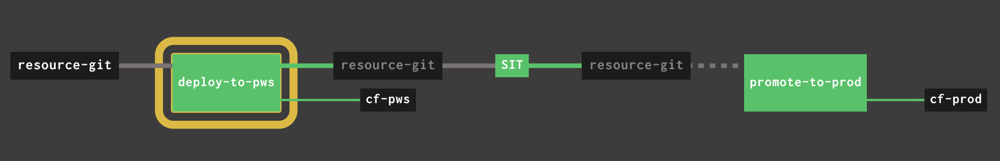

## A Mininalist's Demo CI/CD Pipeline

This is a super simple pipeline to illustrate the basic CI/CD idea to:
1. Deploy an App (Groovy-based here) to QA Cloud Foundry Env;
2. Perform some kind of fantastic SIT;
3. If the SIT is passed, promote it to PROD Cloud Foundry Env automatically or by clicking the "boss" button.

The pipeline looks like this:



## Before You Start

Below you start, I assume you have below setup:
1. A running Concourse and you've already logged in
2. (optional) The Concourse is integrated with CredHub
3. One or two CF/PCF foundations with push-able account(s)
4. Folk this repo to your account (so that you can change it to show some magic)


## How To Play With It?

Now, you can simply follow something like this:

1. Clone it back:

```
$ git clone https://github.com/<YOU-USER>/groovy-pingpong
$ cd groovy-pingpong
```

2. Update the pipeline vars and fly it:

```
$ vi ci/vars.yml        # to update the info accordingly

$ export CC_TARGET=pez  # change it and export your target name
$ fly -t $CC_TARGET sp -p groovy-pingpong -c ci/pipeline.yml -l ci/vars.yml
$ fly -t $CC_TARGET up -p groovy-pingpong
```

3. Wait for a while (< 1min), the pipeline will automatically get started and it will
   - Deploy the `groovy-pingpong` app to QA Env
   - Perform SIT

> Retrieve the app's URL, say `my-groovy-demo.cfapps.io`

4. Open another Console to keep pinging it (to showcase zero downtime for next deployment):

```
$ export APP_PING_URL=https://my-groovy-demo.cfapps.io/ping
$ while true; do curl "${APP_PING_URL}"; echo ""; done
...
Pong: Tue Apr 16 06:24:04 UTC 2019

```

5. In first Console, simulate the manager to **approve** so the app can promote to PROD env

```
$ fly -t $CC_TARGET trigger-job -j groovy-pingpong/promote-to-prod -w
```

6. Update the `app.groovy` by changing the **color** so that the pipeline can deploy a new version, with zero downtime by default.
# democi-groovy
# democi-groovy
# democi-groovy
